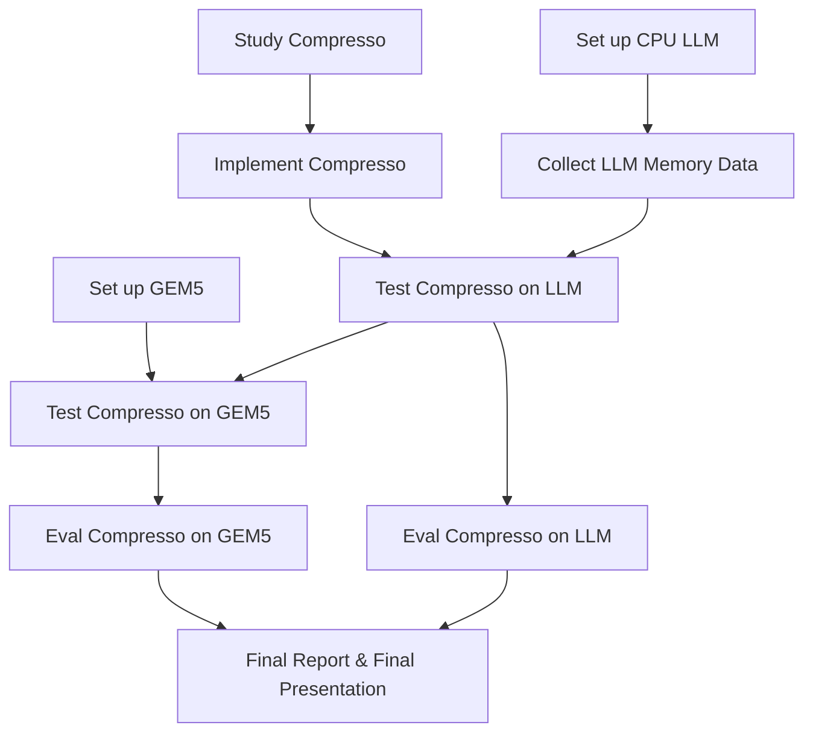

# Compresso Evaluation Project

Evaluate the Compresso compression method on LLM memory data (CPU-based LLM) and on GEM5 simulations.

**Final deadline: December 15th**

## Project Workflow

```mermaid
flowchart TD
    A[Study Compresso] --> B[Implement Compresso]
    C[Set up CPU LLM] --> D[Collect LLM Memory Data]
    E[Set up GEM5]

    B --> F[Test Compresso on LLM]
    D --> F
    E --> G[Test Compresso on GEM5]
    F --> G

    F --> H[Eval Compresso on LLM]
    G --> I[Eval Compresso on GEM5]

    H --> J[Final Report & Final Presentation]
    I --> J
```
